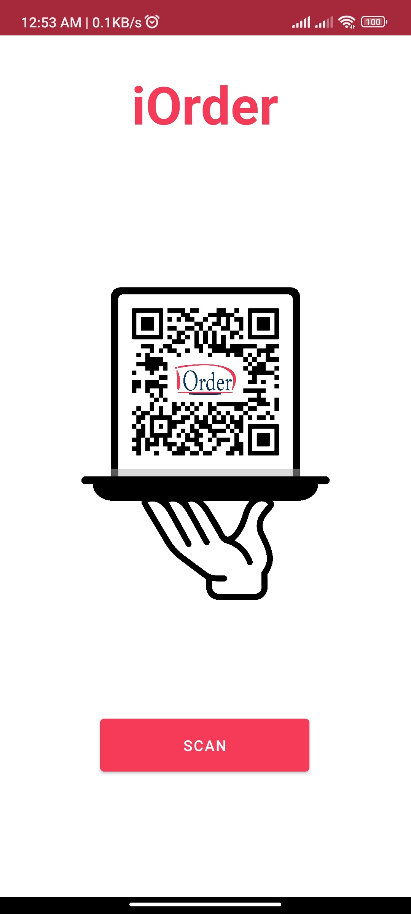
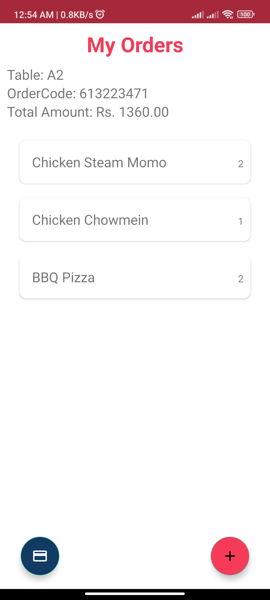
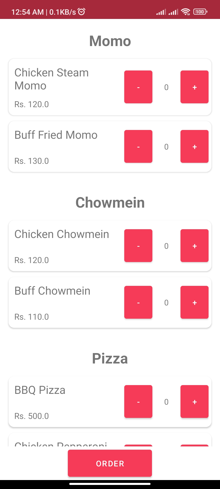

# iOrder

## Self-Ordering App for Restaurants

**Android application created as a project for KU Hackfest 2022. It can be implemented by restaurant to allow their customers to order their foods with their own device by scanning the QR code placed at the table.**

### Pics
---

